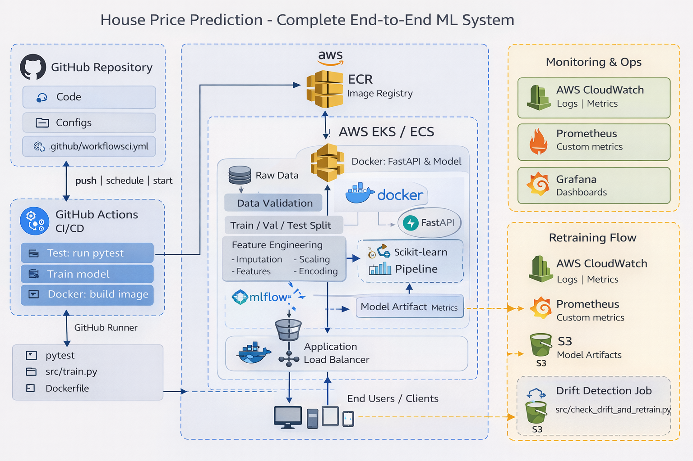
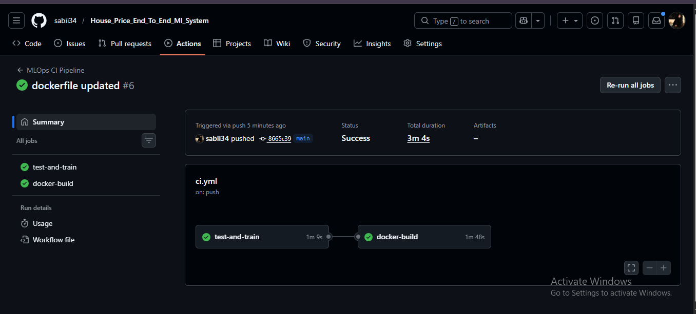

# 🏠 House Price Prediction — End-to-End MLOps System

- An industry-style, production-ready MLOps system for house price prediction, covering the complete ML lifecycle from data ingestion to automated CI/CD, containerized deployment, and monitoring.

- This project is designed to mirror real-world ML systems, not notebooks or toy demos.\*

# Key Highlights

- End-to-end ML system (not just model training)

- Modular, testable, production-grade Python codebase

- Automated CI/CD with GitHub Actions

- Dockerized inference service using FastAPI

- MLflow for experiment tracking & model registry

- Data drift detection & automated retraining logic

- Cloud-ready architecture (AWS ECS / EKS / Cloud Run compatible)

- Monitoring & observability design included

# System Capabilities

## Machine Learning

- Feature preprocessing via ColumnTransformer

- Model pipeline with scikit-learn

- Train / validation / test split automation

- Metrics logging & model versioning

## MLOps

- CI pipeline for testing and training

- Docker image build automation

- Scheduled retraining support

- Drift detection logic

- Production inference API

# ML Lifecycle Implemented

## Data Ingestion

- Raw dataset loading

- Schema & sanity checks

## Data Processing

- Train / validation / test splits

- Feature type inference

## Feature Engineering

- Numerical scaling

- Categorical encoding

- Unified preprocessing pipeline

## Model Training

- Scikit-learn regression pipeline

- Metric evaluation

- Artifact persistence

## Experiment Tracking

- MLflow logging

- Model registry support

## Drift Detection & Retraining

- Input distribution monitoring

- Trigger-based retraining logic

## Inference API

- FastAPI REST service

- Schema validation via Pydantic

- Health check endpoint

## CI/CD Automation

- Unit tests

- Training in CI

- Docker build pipeline

## Dockerized Inference

docker build -t house-price-api .
docker run -p 8000:8000 house-price-api

## Cloud Deployment

- AWS ECS / EKS

- Application Load Balancer

- ECR for container registry

- CloudWatch for logs & metrics

- Prometheus + Grafana for monitoring

- S3 for model artifacts

- Scheduled retraining via EventBridge

# setup

## 0) Clone & go to project

git clone <YOUR_REPO_URL>
cd House_Price_End_To_End_Ml_System

## 1) Create & activate conda environment

conda create -n mlops python=3.10 -y
conda activate mlops

- Install deps:
  pip install --upgrade pip
  pip install -r requirements.txt

## 2) Run the full ML pipeline (data → split → train)

### 2.1 Data ingestion

python -m src.data_loading

## 2.2 Train/val/test split

python -m src.split

## 2.3 Train model (local artifact)

python -m src.train

- Model should be saved in:

- models/pipeline.joblib

## 3) Run tests locally

python -m pytest -q

- Verbose:

python -m pytest -vv

- Single file:

python -m pytest -q tests\test_pipeline_smoke.py

## 4) MLflow tracking + model registry

### 4.1 Train and log to MLflow (and register model)

python -m src.train_mlflow

### 4.2 Start MLflow UI

mlflow ui --backend-store-uri ./mlruns --port 5000

- Open:

http://127.0.0.1:5000

## 4.3 Promote model (if you implemented promote script)

python -m src.promote_model

## 5) Run the FastAPI inference service (local)

### 5.1 Start API with Uvicorn

uvicorn app.main:app --host 0.0.0.0 --port 8000
Open:

Swagger UI: http://127.0.0.1:8000/docs

Health: http://127.0.0.1:8000/health

Version: http://127.0.0.1:8000/version

## 6) Monitoring setup (baseline + live data)

### 6.1 Create baseline (reference) dataset

python -m src.monitoring_baseline

### 6.2 Generate live requests (create monitoring data)

- Run API, then call /predict multiple times using Swagger:

http://127.0.0.1:8000/docs

### 6.3 Run drift check (and retrain if triggered)

python -m src.check_drift_and_retrain

- Drift report output (example):

reports/drift_report.html

## 7) Docker (production-style run)

### 7.1 Build image

docker build -t house-price-api .

### 7.2 Run container

docker run -p 8000:8000 house-price-api
Open:

http://127.0.0.1:8000/docs

http://127.0.0.1:8000/health

### 7.3 View running containers

docker ps

### 7.4 Stop container

docker stop <CONTAINER_ID>

## 8) CI/CD (GitHub Actions)

CI runs automatically on:

Push to main

Pull request

Manual run (workflow_dispatch)

Schedule (cron)

## To verify locally before pushing:

python -m pytest -q
python -m src.data_loading
python -m src.split
python -m src.train_mlflow
docker build -t house-price-api.

## 🏗️ System Architecture

The diagram below shows the complete end-to-end MLOps architecture,
covering ML training, CI/CD, deployment on AWS, monitoring, and retraining.

## 🧪 Experiment Tracking (MLflow)

All experiments, metrics, parameters, and model versions are tracked using MLflow.

## 🔄 CI/CD Pipeline (GitHub Actions)

The project includes a fully automated CI pipeline that:

- Runs tests
- Trains the model
- Builds a Docker image

